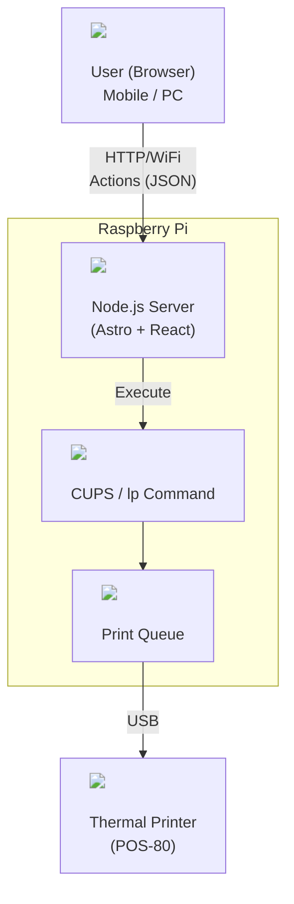

# POS-80 Thermal Printer Controller

An Astro-based web web interface for controlling a POS-80 thermal printer connected to a Raspberry Pi. This application allows you to print text and images directly from your browser using a modern, responsive UI.


##  Features

- **Text Printing**: Send raw text directly to the printer.
- **Image Printing**: Upload images which are automatically resized and dithered (Floyd-Steinberg) for optimal thermal printing.
- **Queue Management**: Monitor the status of the print queue.
- **Modern UI**: Clean interface built with Astro, React, and TailwindCSS.

##  Tech Stack

-  **Framework**: [Astro](https://astro.build/)
-  **UI Library**: [React](https://react.dev/)
-  **Styling**: [TailwindCSS](https://tailwindcss.com/)
-  **Image Processing**: [Sharp](https://sharp.pixelplumbing.com/)
-  **Backend Interaction**: `actions` (Astro Actions) calling system `lp` commands.
-  **Process Manager**: [PM2](https://pm2.keymetrics.io/) (for production process management)

##  System Architecture


 
##  Getting Started

### Prerequisites

- Node.js (v18 or higher)
- A Raspberry Pi (or Linux system) with CUPS installed and a thermal printer configured.
- The `lp` command line tool should be available in the environment.

### Installation

1. Clone the repository:
   ```bash
   git clone <repository-url>
   cd orbital-skylab
   ```

2. Install dependencies:
   ```bash
   pnpm install
   ```

3. Start the development server:
   ```bash
   pnpm dev
   ```

4. Build for production:
   ```bash
   pnpm build
   ```

5. Preview the production build:
   ```bash
   pnpm preview
   ```

##  Project Structure

```text
/
├── public/             # Static assets
├── src/
│   ├── actions/        # Server-side actions (printing logic)
│   ├── components/     # React components (TextPrinter, ImagePrinter, etc.)
│   ├── layouts/        # Astro layouts
│   ├── pages/          # Application routes
│   └── styles/         # Global styles (including Tailwind)
└── package.json
```

##  Important Notes

- **Printer Firmware**: For printing Japanese text, the thermal printer must support **Shift_JIS (CP932)** encoding and have Japanese fonts (Kanji ROM) installed in its firmware, as text is sent in raw mode.
- **Permissions**: The Node.js process must have permission to execute `lp` commands.

##  License

MIT
