# POS-80 Thermal Printer Controller

An Astro-based web web interface for controlling a POS-80 thermal printer connected to a Raspberry Pi. This application allows you to print text and images directly from your browser using a modern, responsive UI.


## ✨ Features

- **Text Printing**: Send raw text directly to the printer.
- **Image Printing**: Upload images which are automatically resized and dithered (Floyd-Steinberg) for optimal thermal printing.
- **Queue Management**: Monitor the status of the print queue.
- **Modern UI**: Clean interface built with Astro, React, and TailwindCSS.

## 🛠️ Tech Stack

- **Framework**: [Astro](https://astro.build/)
- **UI Library**: [React](https://react.dev/)
- **Styling**: [TailwindCSS](https://tailwindcss.com/)
- **Image Processing**: [Sharp](https://sharp.pixelplumbing.com/)
- **Backend Interaction**: `actions` (Astro Actions) calling system `lp` commands.

## 🏗️ System Architecture

```mermaid
graph TD
    User["📱 User (Browser)<br/>Mobile / PC"]
    
    subgraph "Raspberry Pi"
        Server["Node.js Server<br/>(Astro + React)"]
        CUPS["🖨️ CUPS / lp Command"]
        Queue["Print Queue"]
    end
    
    Printer["🧾 Thermal Printer<br/>(POS-80)"]

    User --"HTTP/WiFi<br/>Actions (JSON)"--> Server
    Server --"Execute"--> CUPS
    CUPS --> Queue
    Queue --"USB"--> Printer
```


 
## 🚀 Getting Started

### Prerequisites

- Node.js (v18 or higher)
- A Raspberry Pi (or Linux system) with CUPS installed and a thermal printer configured.
- The `lp` command line tool should be available in the environment.

### Installation

1. Clone the repository:
   ```bash
   git clone <repository-url>
   cd orbital-skylab
   ```

2. Install dependencies:
   ```bash
   pnpm install
   ```

3. Start the development server:
   ```bash
   pnpm dev
   ```

4. Build for production:
   ```bash
   pnpm build
   ```

5. Preview the production build:
   ```bash
   pnpm preview
   ```

## 📂 Project Structure

```text
/
├── public/             # Static assets
├── src/
│   ├── actions/        # Server-side actions (printing logic)
│   ├── components/     # React components (TextPrinter, ImagePrinter, etc.)
│   ├── layouts/        # Astro layouts
│   ├── pages/          # Application routes
│   └── styles/         # Global styles (including Tailwind)
└── package.json
```

## ⚠️ Important Notes

- **System Fonts**: For printing non-ASCII characters (like Japanese), ensure the host system has the appropriate fonts installed and configured for the printer.
- **Permissions**: The Node.js process must have permission to execute `lp` commands.

## 📄 License

MIT
